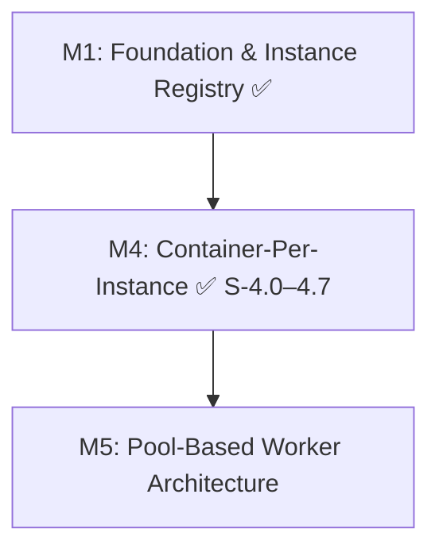

# Claude Agent SDK as a Service — Implementation Plan

## Context

The Office project's agent orchestration runs inline within Vercel serverless functions. Fire-and-forget tasks get killed when the response is sent, there's no persistent session state, and function timeouts limit agent run duration. This new service runs as a long-lived container process managing named Claude Agent SDK instances.

**Goal**: Provide a stateful, observable agent runtime that can be invoked from any HTTP client with SSE streaming responses.

**Horizontal Requirements** (all milestones):
- Strict TypeScript, named exports, kebab-case files
- Validate at API boundaries with Zod
- `npm run test` must pass after each story
- **Testing is mandatory**: each story must include unit tests and integration tests where applicable. Vitest is the test framework.
- **Every story must be demoable**: the implementer must show a live demo before claiming completion.
- **Each story = one pull request**: stories are implemented and merged independently on their own feature branch.
- **Telemetry is mandatory** (from S-1.1 onward): every story after S-1.1 must include a telemetry validation AC confirming Sentry traces/spans/logs are emitted for key operations.

## Milestone Overview & Dependency Graph

## Milestones

| Milestone | Description | Stories | Status | File |
|-----------|-------------|---------|--------|------|
| [M1](milestone-1-foundation.md) | Foundation & Instance Registry | S-1.0 through S-1.4 | Complete | `milestone-1-foundation.md` |
| [M4](milestone-4-containerization.md) | Container-Per-Instance Architecture | S-4.0 through S-4.7 | Complete (S-4.8+ superseded by M5) | `milestone-4-containerization.md` |
| [M5](milestone-5-pool-architecture.md) | Pool-Based Worker Architecture | S-5.0 through S-5.6 | Planned | `milestone-5-pool-architecture.md` |

> **Note**: M2 (Agent Invocation & Streaming) and M3 (Management UI) were superseded by M4, which implements the same capabilities via container-per-instance architecture instead of in-process SDK execution. M4 stories S-4.8+ (instance lifecycle rewrite, dashboard, E2E) are superseded by M5, which replaces the Railpack build flow with pre-built Docker images and a dormant worker pool.

## Verification

After each story:
1. `npm run test` passes
2. **Live demo** of the story's functionality (mandatory — user must see it working)
3. Sentry telemetry visible for key operations (from S-1.1 onward)

## Risks & Mitigations

| Risk | Mitigation |
|------|-----------|
| Claude Agent SDK API differs from spec pseudocode | Inspect actual SDK exports after install in S-1.0; adapt accordingly |
| Agent responses too slow for good UX | SSE streaming gives immediate feedback |
| Runaway agent costs | maxBudgetUsd per invocation, maxTurns limit |
| In-memory state lost on restart | Accepted trade-off; caller reprovisions on startup |
| Railway API rate limits | Batch operations where possible; retry with backoff |
| Railway image source API shape unknown | Confirm `serviceCreate` accepts `source: { image }` field; fallback to CLI if needed |
| Pool cold start on CP restart | Pool monitor creates dormant workers in background; first few provisions may wait |
| Dormant worker pool exhaustion | Pool monitor replenishes automatically; burst creation if pool empty |
