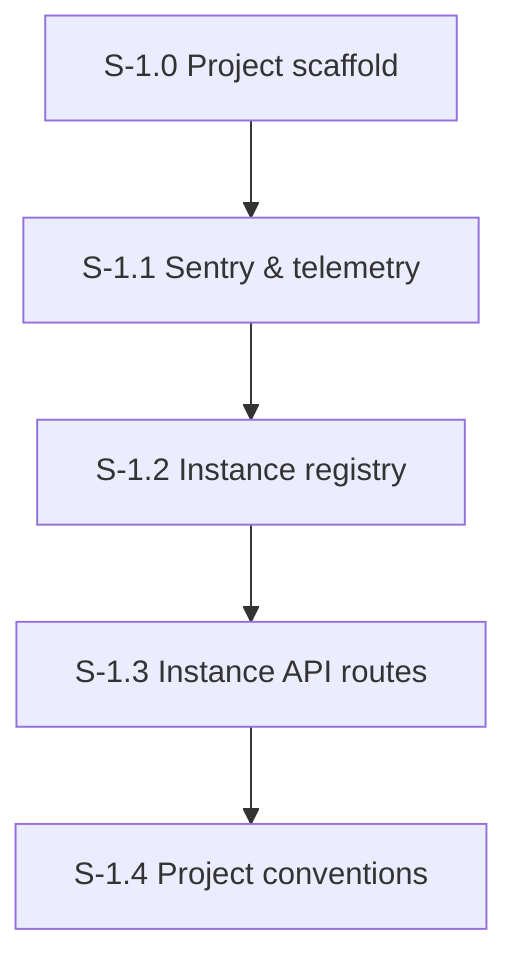

# Milestone 1: Foundation & Instance Registry

**Goal**: Project scaffold, telemetry, instance store, and API routes.

---

## [S-1.0] Project Scaffold

As a developer, I want a working project skeleton so I can start building the service.

### Description
Initialize the project with npm, TypeScript, ESLint, Vitest, Hono server, and a basic health endpoint. Include Dockerfile for container deployment to Railway. Add `@railway/cli` as a dev dependency for easy deploys.

### Files to create
| File | Purpose |
|------|---------|
| `package.json` | Dependencies: hono, @hono/node-server, @anthropic-ai/claude-agent-sdk, @sentry/node, zod, typescript, vitest, tsx, eslint, @railway/cli (dev) |
| `tsconfig.json` | Strict mode, ES2022 target, Node module resolution |
| `.eslintrc.json` | TypeScript ESLint config |
| `Dockerfile` | Multi-stage build: npm ci -> tsc -> node dist/index.js |
| `src/index.ts` | Entry point: start Hono server on PORT |
| `src/server.ts` | Hono app with route wiring |
| `src/routes/health.ts` | GET /v1/health -> { status: "ok", uptime, instanceCount: 0 } |
| `vitest.config.ts` | Vitest configuration |

### Acceptance Criteria
- [ ] [AC-1.0.1] `npm install` succeeds with all dependencies
- [ ] [AC-1.0.2] `npm run dev` starts server on configurable PORT (default 8080)
- [ ] [AC-1.0.3] `GET /v1/health` returns `{ status: "ok", uptime: number, instanceCount: 0 }`
- [ ] [AC-1.0.4] `npm run build` produces compiled JS in `dist/`
- [ ] [AC-1.0.5] `npm run typecheck` passes with strict mode
- [ ] [AC-1.0.6] `npm run lint` passes
- [ ] [AC-1.0.7] `npm run test` runs Vitest (health route test passes)
- [ ] [AC-1.0.8] Dockerfile builds and runs successfully
- [ ] [AC-1.0.9] `npm run deploy` runs `railway up -d` for one-command deployment
- [ ] [AC-1.0.10] `railway link` connects project to Railway service (one-time setup documented in AGENTS.md)

### Demo
Start the server, curl the health endpoint, show response. Deploy to Railway with `npm run deploy`, show health endpoint on Railway URL.

---

## [S-1.1] Sentry & Telemetry Helpers

As a developer, I want distributed tracing, logging, and metrics via Sentry so I can observe all service operations.

### Description
Set up @sentry/node, create telemetry helpers (withSpan, logInfo/logWarn/logError, countMetric, distributionMetric, chunkedLog), HTTP middleware for trace propagation, and console log formatting.

### Files to create
| File | Purpose |
|------|---------|
| `src/telemetry/init.ts` | `initSentry()` — Sentry.init with 100% sampling, enableLogs, beforeSendSpan console logging |
| `src/telemetry/helpers.ts` | withSpan, logInfo/logWarn/logError, countMetric, distributionMetric, chunkedLog |
| `src/telemetry/middleware.ts` | Hono middleware: extract sentry-trace/baggage, start server span, attach trace ID to response |

### Files to modify
| File | Change |
|------|--------|
| `src/index.ts` | Call initSentry() before server start |
| `src/server.ts` | Add telemetry middleware |

### Acceptance Criteria
- [ ] [AC-1.1.1] Sentry.init called with 100% sampling and enableLogs
- [ ] [AC-1.1.2] `beforeSendSpan` logs every span to console in format: `[sentry] {op} | {description} | {duration}ms | trace={traceId}`
- [ ] [AC-1.1.3] `withSpan(name, op, fn)` wraps async function in Sentry span
- [ ] [AC-1.1.4] `logInfo/logWarn/logError` emit Sentry structured logs with attributes
- [ ] [AC-1.1.5] `countMetric/distributionMetric` emit Sentry metrics
- [ ] [AC-1.1.6] `chunkedLog(prefix, text, maxLen=5000)` splits long text into `[chunk N/M]` log entries
- [ ] [AC-1.1.7] HTTP middleware extracts sentry-trace header and continues parent trace
- [ ] [AC-1.1.8] Response includes `x-sentry-trace-id` header
- [ ] [AC-1.1.9] Health endpoint now emits a Sentry span
- [ ] [AC-1.1.10] Unit tests for all helper functions (withSpan, chunkedLog, etc.)

### Demo
Curl the health endpoint with a sentry-trace header. Show console output with trace propagation. Show the x-sentry-trace-id response header.

---

## [S-1.2] Instance Registry

As a developer, I want an in-memory instance store with hierarchy support so I can manage agent instances.

### Description
Implement the AgentInstance type and in-memory store with CRUD operations, hierarchy validation, and prefix-based operations.

### Files to create
| File | Purpose |
|------|---------|
| `src/registry/types.ts` | AgentInstance type, McpServerConfig type, validation schemas (Zod) |
| `src/registry/store.ts` | InstanceStore class: provision, get, list, update, delete, nukeByPrefix, validateName |

### Acceptance Criteria
- [ ] [AC-1.2.1] AgentInstance type matches spec: name, systemPrompt, mcpServers, model, maxTurns, maxBudgetUsd, sessionId, status, createdAt, etc.
- [ ] [AC-1.2.2] `provision(config)` creates instance with defaults (model=claude-haiku-4-5-20251001, maxTurns=50, maxBudgetUsd=1.0)
- [ ] [AC-1.2.3] `provision()` rejects duplicate names -> throws with 409 semantics
- [ ] [AC-1.2.4] `get(name)` returns instance or null
- [ ] [AC-1.2.5] `list(prefix?)` returns all instances, optionally filtered by prefix
- [ ] [AC-1.2.6] `update(name, partial)` updates provided fields only, resets sessionId on any config change
- [ ] [AC-1.2.7] `update()` rejects while status is "running" -> throws with 409 semantics
- [ ] [AC-1.2.8] `delete(name)` removes exact instance, returns deleted count (0 or 1)
- [ ] [AC-1.2.9] `nukeByPrefix(prefix)` deletes all matching prefix, returns deleted count
- [ ] [AC-1.2.10] Name validation: regex `[a-zA-Z0-9][a-zA-Z0-9._-]*(/[a-zA-Z0-9][a-zA-Z0-9._-]*)*`, no leading/trailing/double slashes
- [ ] [AC-1.2.11] Health endpoint updated: instanceCount reflects actual store size
- [ ] [AC-1.2.12] All operations emit Sentry telemetry (spans + logs)
- [ ] [AC-1.2.13] Unit tests for all store operations, including edge cases (duplicate names, invalid names, prefix matching, nuke with active instances)

### Demo
Provision 5 instances under dev/A/ prefix. List by prefix. Nuke by prefix. Show count returns to 0.

---

## [S-1.3] Instance API Routes

As a developer, I want HTTP endpoints for all instance CRUD operations.

### Description
Wire the instance store to Hono routes with Zod validation, proper HTTP status codes, and telemetry.

### Files to create
| File | Purpose |
|------|---------|
| `src/routes/instances.ts` | All instance CRUD routes |

### Files to modify
| File | Change |
|------|--------|
| `src/server.ts` | Wire instance routes |

### Acceptance Criteria
- [ ] [AC-1.3.1] `POST /v1/instances` — provisions instance, validates body with Zod, returns 201
- [ ] [AC-1.3.2] `POST /v1/instances` with duplicate name -> 409 Conflict
- [ ] [AC-1.3.3] `GET /v1/instances` — lists all instances, supports `?prefix=` query param
- [ ] [AC-1.3.4] `GET /v1/instances/{name}` — returns instance or 404 (name is wildcard path param to support slashes)
- [ ] [AC-1.3.5] `PATCH /v1/instances/{name}` — partial update, 404 if not found, 409 if running
- [ ] [AC-1.3.6] `DELETE /v1/instances/{name}` — delete exact or nuke by prefix, returns `{ deleted: N }`
- [ ] [AC-1.3.7] All routes validate input with Zod, return 400 with error details on validation failure
- [ ] [AC-1.3.8] All routes emit Sentry spans and structured logs
- [ ] [AC-1.3.9] Integration tests for all routes (HTTP-level tests using Hono test client)
- [ ] [AC-1.3.10] Nuke deletes all instances with matching prefix, returns count

### Demo
Full CRUD cycle via curl: provision -> get -> list -> update -> delete. Show prefix listing and nuke.

---

## [S-1.4] Project Conventions

As a developer, I want documented conventions so all agents working on this codebase follow consistent patterns.

### Files to create
| File | Purpose |
|------|---------|
| `CLAUDE.md` | Project conventions (already written by another agent) |

### Acceptance Criteria
- [ ] [AC-1.4.1] CLAUDE.md documents: commands, architecture, directory structure, code conventions, testing strategy, telemetry requirements
- [ ] [AC-1.4.2] CLAUDE.md is consistent with actual project structure and patterns established in S-1.0 through S-1.3

### Demo
Read CLAUDE.md, verify it matches actual project state.
