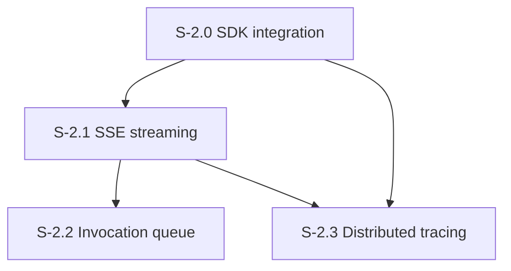

# Milestone 2: Agent Invocation & Streaming

**Goal**: Integrate Claude Agent SDK, implement SSE streaming, session management, invocation queue, and distributed tracing.

---

## [S-2.0] SDK Integration

As a developer, I want a wrapper around the Claude Agent SDK query() function that manages sessions and maps message types.

### Description
Create the SDK executor that wraps query() with instance config (system prompt, MCP servers, model, budget, turns), handles session resume, and processes all SDK message types. Map SDK messages to internal event types. Set up OTEL environment variables for subprocess tracing.

### Files to create
| File | Purpose |
|------|---------|
| `src/sdk/executor.ts` | `executeInvocation(instance, prompt, options?)` — wraps SDK query(), manages session, yields events |
| `src/sdk/events.ts` | SDK message -> internal event type mapping (init, assistant_text, tool_use, tool_result, turn_complete, done, error) |
| `src/sdk/env.ts` | `buildOtelEnv(sentryDsn, traceContext)` — builds OTEL env vars for SDK subprocess |

### Acceptance Criteria
- [ ] [AC-2.0.1] `executeInvocation()` calls SDK `query()` with systemPrompt, mcpServers, model, maxTurns, maxBudgetUsd from instance config
- [ ] [AC-2.0.2] First invocation creates new session; subsequent invocations use `resume` with stored sessionId
- [ ] [AC-2.0.3] After invocation, sessionId is updated on the instance
- [ ] [AC-2.0.4] All SDK message types handled: result, assistant text chunks, tool use, tool result, etc.
- [ ] [AC-2.0.5] SDK messages mapped to internal event types (init, assistant_text, tool_use, tool_result, turn_complete, done, error)
- [ ] [AC-2.0.6] Errors during SDK execution caught and mapped to error events (don't crash server)
- [ ] [AC-2.0.7] Instance status transitions: ready -> running -> ready (or error)
- [ ] [AC-2.0.8] OTEL env builder parses Sentry DSN to derive OTLP endpoint and auth headers
- [ ] [AC-2.0.9] Liberal logging: system prompt (chunked), each assistant turn, each tool call/result, final summary with turns/cost/duration
- [ ] [AC-2.0.10] Sentry span wraps entire invocation with child spans for turns
- [ ] [AC-2.0.11] Unit tests with mocked SDK (verify event mapping, session management, error handling)

### Demo
Create an instance, invoke it with a simple prompt. Show the logged events in console. Show session ID persisted. Invoke again, show session resumed.

---

## [S-2.1] SSE Streaming

As a developer, I want invoke requests to return SSE streams so the caller gets real-time feedback.

### Description
Wire the invoke endpoint as SSE. SDK executor events are mapped to SSE events and streamed to the client. Implement abort on client disconnect.

### Files to create
| File | Purpose |
|------|---------|
| `src/routes/invoke.ts` | `POST /v1/instances/{name}/invoke` -> SSE stream |

### Files to modify
| File | Change |
|------|--------|
| `src/server.ts` | Wire invoke route |

### Acceptance Criteria
- [ ] [AC-2.1.1] `POST /v1/instances/{name}/invoke` returns `text/event-stream` response
- [ ] [AC-2.1.2] Request body validated with Zod: `{ prompt: string, traceContext?: { sentryTrace, baggage } }`
- [ ] [AC-2.1.3] SSE events emitted for all event types: init, assistant_text, tool_use, tool_result, turn_complete, done, error
- [ ] [AC-2.1.4] Each SSE event has `event:` field and `data:` field with JSON payload
- [ ] [AC-2.1.5] Instance not found -> 404 (not SSE)
- [ ] [AC-2.1.6] Client disconnect -> invocation cancelled, instance returns to ready
- [ ] [AC-2.1.7] All events logged to console in the log line format: `{instance} | {event}.{turn} | {content}`
- [ ] [AC-2.1.8] Sentry span wraps the full SSE stream
- [ ] [AC-2.1.9] Integration tests: invoke and verify SSE event sequence

### Demo
Provision an instance, invoke via curl. Show SSE events streaming in real-time. Disconnect mid-stream, show invocation cancelled.

---

## [S-2.2] Invocation Queue

As a developer, I want invocations to queue when an instance is busy so we don't lose requests.

### Description
Implement per-instance FIFO queue. When an instance is already running, new invocations are queued and processed in order. Check if SDK has built-in queueing first.

### Files to create
| File | Purpose |
|------|---------|
| `src/queue/instance-queue.ts` | Per-instance FIFO queue with configurable max depth |

### Files to modify
| File | Change |
|------|--------|
| `src/routes/invoke.ts` | Integrate queue: enqueue if busy, reject if full |
| `src/registry/types.ts` | Add queueDepth, activeInvocationId to instance type |

### Acceptance Criteria
- [ ] [AC-2.2.1] When instance is ready, invocation starts immediately
- [ ] [AC-2.2.2] When instance is running, invocation is queued (FIFO)
- [ ] [AC-2.2.3] When current invocation completes, next in queue starts automatically
- [ ] [AC-2.2.4] Queue max depth configurable (default 25), 429 when full with `Retry-After` header
- [ ] [AC-2.2.5] Queue depth visible on instance (`queueDepth` field)
- [ ] [AC-2.2.6] Nuke cancels active invocation AND clears queue for affected instances
- [ ] [AC-2.2.7] Queue metrics: queue.depth gauge
- [ ] [AC-2.2.8] Unit tests: queue ordering, max depth rejection, auto-dequeue after completion, nuke clears queue

### Demo
Provision instance, send 3 rapid invocations. Show first runs immediately, second queues, third queues. Show sequential processing. Send 26th to show 429.

---

## [S-2.3] Distributed Tracing

As a developer, I want end-to-end distributed tracing so I can follow a request from the caller through the SDK to MCP servers.

### Description
Accept sentry-trace and baggage headers on invoke requests. Propagate trace context through SDK via OTEL env vars. Implement MCP trace linking (span links, not parent-child). Verify E2E trace in Sentry.

### Files to modify
| File | Change |
|------|--------|
| `src/routes/invoke.ts` | Extract trace context from request, pass to executor |
| `src/sdk/executor.ts` | Pass OTEL env to SDK subprocess |
| `src/sdk/env.ts` | Include trace parent propagation |

### Acceptance Criteria
- [ ] [AC-2.3.1] Invoke endpoint extracts `sentry-trace` and `baggage` headers from request
- [ ] [AC-2.3.2] Invocation trace is a child of the caller's trace (when sentry-trace provided)
- [ ] [AC-2.3.3] OTEL env vars passed to SDK subprocess for trace propagation
- [ ] [AC-2.3.4] MCP calls create new traces with span links back to originating trace (not parent-child)
- [ ] [AC-2.3.5] Verify: caller trace -> invoke span -> SDK turns -> MCP span link visible in Sentry
- [ ] [AC-2.3.6] Without sentry-trace header, a new root trace is created (no error)
- [ ] [AC-2.3.7] Integration test: invoke with sentry-trace header, verify response has correlated trace ID

### Demo
Call invoke with a sentry-trace header. Show in Sentry: the caller's trace links to the invocation trace, which shows SDK turns and MCP span links.
