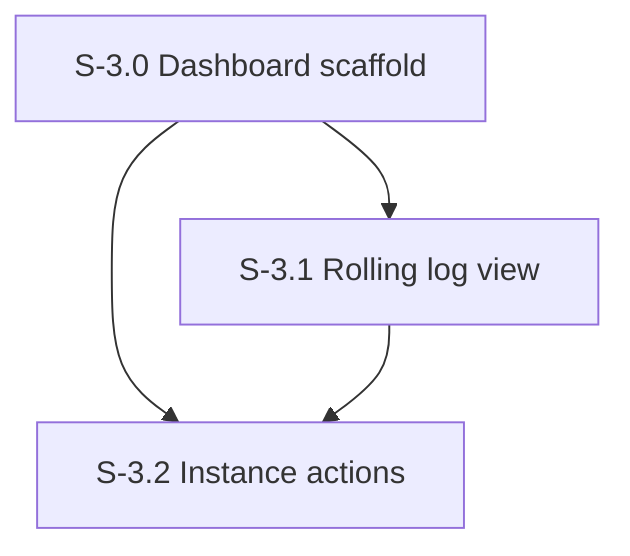

# Milestone 3: Management UI

**Goal**: Web dashboard for inspecting state, viewing real-time logs, and performing management actions.

---

## [S-3.0] Dashboard Scaffold

As a developer, I want a single-page dashboard served at /ui so I can inspect instance state at a glance.

### Description
Create a single HTML file with inline CSS and JS. Served by Hono at GET /ui. Shows instance tree grouped by hierarchy prefix with status indicators. Responsive layout with collapsible sidebar.

### Files to create
| File | Purpose |
|------|---------|
| `src/ui/dashboard.html` | Single-file HTML dashboard (CSS + JS inlined) |
| `src/routes/ui.ts` | Serve dashboard.html at GET /ui |

### Files to modify
| File | Change |
|------|--------|
| `src/server.ts` | Wire UI route |

### Acceptance Criteria
- [ ] [AC-3.0.1] `GET /ui` returns the HTML dashboard
- [ ] [AC-3.0.2] Instance tree sidebar shows all instances grouped by hierarchy prefix
- [ ] [AC-3.0.3] Each instance shows status badge: ready (green), running (blue), queued (yellow), error (red)
- [ ] [AC-3.0.4] Click instance in tree -> shows instance detail in main area (config, status, session, etc.)
- [ ] [AC-3.0.5] Sidebar is collapsible on narrow screens
- [ ] [AC-3.0.6] Status bar at bottom: connection status, instance count, running count
- [ ] [AC-3.0.7] Page fetches instance data from `GET /v1/instances` on load and renders tree
- [ ] [AC-3.0.8] No build step — pure HTML/CSS/JS
- [ ] [AC-3.0.9] Dark theme, monospace font, terminal aesthetic

### Demo
Start server with a few provisioned instances. Open /ui in browser. Show instance tree with hierarchy grouping and status badges. Click an instance to see details.

---

## [S-3.1] Rolling Log View

As a developer, I want real-time rolling logs in the dashboard so I can observe agent behavior live.

### Description
Create SSE endpoint that streams log lines. Dashboard renders them in real-time with color coding, auto-scroll, and client-side filtering.

### Files to create
| File | Purpose |
|------|---------|
| `src/routes/logs.ts` | `GET /v1/logs` — SSE endpoint streaming log lines |

### Files to modify
| File | Change |
|------|--------|
| `src/server.ts` | Wire logs route |
| `src/telemetry/helpers.ts` | Add log line emitter that feeds both console and SSE |
| `src/ui/dashboard.html` | Add log stream panel with SSE client, filtering, auto-scroll |

### Acceptance Criteria
- [ ] [AC-3.1.1] `GET /v1/logs` returns `text/event-stream` with log line events
- [ ] [AC-3.1.2] Log lines arrive in real-time as instance operations happen
- [ ] [AC-3.1.3] Optional `?prefix=` query param for server-side log filtering
- [ ] [AC-3.1.4] Keepalive comments every 30s to prevent timeout
- [ ] [AC-3.1.5] Dashboard renders log lines with color coding (provision=blue, invoke=green, error=red, tool_use=yellow)
- [ ] [AC-3.1.6] Auto-scroll to bottom, pauses when user scrolls up, resumes when scrolling back down
- [ ] [AC-3.1.7] Client-side filter input to narrow visible logs by typing prefix
- [ ] [AC-3.1.8] Max 1000 lines in DOM (older removed for memory)
- [ ] [AC-3.1.9] SSE reconnects automatically on disconnect
- [ ] [AC-3.1.10] Sentry span for the SSE connection lifecycle

### Demo
Open /ui, provision a few instances and invoke them. Show log lines appearing in real-time. Filter by prefix. Scroll up to pause, scroll down to resume.

---

## [S-3.2] Instance Actions

As a developer, I want to nuke instances and send test messages from the dashboard.

### Description
Add nuke button (by prefix with confirm dialog) and send message form (triggers invoke, shows SSE response inline).

### Files to modify
| File | Change |
|------|--------|
| `src/ui/dashboard.html` | Add nuke buttons, send message form, confirm dialogs, inline SSE response rendering |

### Acceptance Criteria
- [ ] [AC-3.2.1] Nuke button on sidebar prefix groups and instance detail view
- [ ] [AC-3.2.2] Nuke shows confirm dialog with prefix and estimated count
- [ ] [AC-3.2.3] After nuke, instance tree auto-refreshes
- [ ] [AC-3.2.4] Send message form: instance selector dropdown + prompt text input + send button
- [ ] [AC-3.2.5] Clicking instance in tree pre-fills the instance selector
- [ ] [AC-3.2.6] Send button triggers `POST /v1/instances/{name}/invoke`, SSE response rendered inline below form
- [ ] [AC-3.2.7] Inline response shows: assistant text streaming, tool calls, final summary
- [ ] [AC-3.2.8] "Nuke All" button in header with double-confirm dialog
- [ ] [AC-3.2.9] All actions emit appropriate telemetry

### Demo
Open /ui with instances. Click nuke on a prefix — confirm, see tree update. Type a message in send form, see SSE response stream inline. Click Nuke All — double confirm, see everything cleared.
