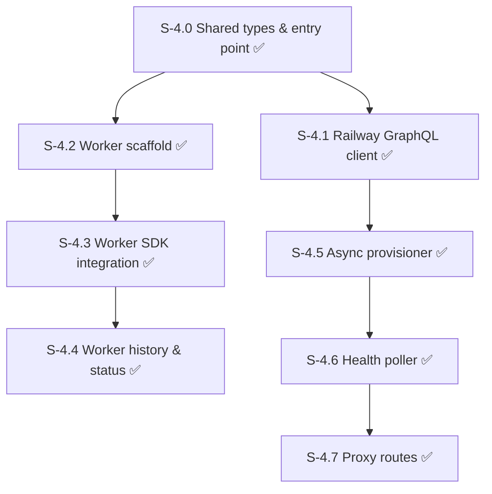

# Milestone 4: Container-Per-Instance Architecture

**Goal**: Replace in-process SDK execution with one container per instance. The current AAS becomes a control plane that provisions and manages worker containers via Railway's API. Workers run the SDK, expose their own HTTP API, and are managed by the control plane.

**Dependency**: M3 (Management UI) must be complete before starting M4.

**Status**: Stories S-4.0 through S-4.7 are complete. Remaining work (instance lifecycle rewrite, deployment, E2E) is superseded by **[M5: Pool-Based Worker Architecture](milestone-5-pool-architecture.md)**, which replaces the per-agent Railpack build flow with pre-built Docker images and a dormant worker pool.

---

## [S-4.0] Shared Types & Entry Point ✅

As a developer, I want a dual-role entry point so a single codebase can boot as either control plane or worker.

### Description

Extract shared types into `src/shared/types.ts` and create `src/entry.ts` that reads `AAS_ROLE` and dispatches to the appropriate server. Move `InstanceRecord`, `McpServerConfig`, and shared Zod schemas into the shared module.

### Files to create/modify

| File | Purpose |
|------|---------|
| `src/shared/types.ts` | `InstanceRecord`, `McpServerConfig`, status union, shared Zod schemas |
| `src/entry.ts` | Reads `AAS_ROLE`, initializes Sentry, boots control-plane or worker |

### Acceptance Criteria

- [ ] `AAS_ROLE=control-plane` boots the existing Hono server
- [ ] `AAS_ROLE=worker` logs "worker mode" and exits (placeholder)
- [ ] Missing/invalid `AAS_ROLE` exits with clear error message
- [ ] `InstanceRecord` type replaces `AgentInstance` throughout codebase
- [ ] New status union: `provisioning | deploying | ready | unreachable | error | destroying`
- [ ] All existing tests pass
- [ ] Sentry telemetry: entry point role selection logged

---

## [S-4.1] Railway GraphQL Client ✅

As a developer, I want a typed client for Railway's GraphQL API so the control plane can manage worker services.

### Description

Create `src/railway/client.ts` with methods for service CRUD, environment variable management, and domain creation. All methods wrapped in Sentry spans.

### Files to create

| File | Purpose |
|------|---------|
| `src/railway/client.ts` | Railway GraphQL API client |
| `src/railway/client.test.ts` | Unit tests with mocked HTTP |

### Acceptance Criteria

- [ ] `serviceCreate(name)` → creates a Railway service, returns serviceId
- [ ] `serviceDelete(serviceId)` → deletes a Railway service
- [ ] `variableCollectionUpsert(serviceId, vars)` → sets env vars on a service
- [ ] `serviceDomainCreate(serviceId)` → creates an internal domain, returns URL
- [ ] All methods wrapped in Sentry spans with `railway_api.*` metrics
- [ ] Graceful error handling: Railway API errors are caught and re-thrown with context
- [ ] Env var validated on init: `RAILWAY_API_TOKEN` (required, set manually). `RAILWAY_PROJECT_ID` and `RAILWAY_ENVIRONMENT_ID` are auto-injected by Railway at runtime

---

## [S-4.2] Worker Scaffold ✅

As a developer, I want a worker Hono server with a health endpoint so Railway can detect when the worker is ready.

### Description

Create `src/worker/server.ts` with a minimal Hono app and `GET /health` endpoint. Parse worker config from env vars. Wire into `entry.ts` so `AAS_ROLE=worker` boots this server.

### Files to create

| File | Purpose |
|------|---------|
| `src/worker/server.ts` | Worker Hono app + route wiring |
| `src/worker/config.ts` | Parse and validate worker env vars |
| `src/worker/routes.ts` | Route handlers (initially just health) |
| `src/worker/routes.test.ts` | Unit tests |

### Acceptance Criteria

- [ ] `AAS_ROLE=worker` boots worker Hono server on `PORT`
- [ ] `GET /health` returns `{ status: "ok", instanceName: "..." }`
- [ ] Worker config parsed from env vars with Zod validation
- [ ] Missing required env vars → clear error message and exit
- [ ] Sentry initialized with worker-specific service name
- [ ] Existing control-plane tests unaffected

---

## [S-4.3] Worker SDK Integration ✅

As a developer, I want the worker to process messages via the Claude Agent SDK and stream responses as SSE.

### Description

Create `src/worker/sdk-runner.ts` and implement the `POST /message` endpoint. The worker executes the SDK `query()` call, streams events as SSE, and manages session resume across messages.

### Files to create/modify

| File | Purpose |
|------|---------|
| `src/worker/sdk-runner.ts` | SDK `query()` wrapper, session tracking |
| `src/worker/queue.ts` | Worker-side FIFO invocation queue |
| `src/worker/routes.ts` | Add `/message` route handler |

### Acceptance Criteria

- [ ] `POST /message` starts SDK invocation and streams SSE events
- [ ] Session resume: second message uses `sessionId` from first
- [ ] FIFO queue: concurrent messages queued, `queued` SSE event sent
- [ ] Queue full (25) → 429 Too Many Requests
- [ ] SSE events match spec: `queued`, `init`, `assistant_text`, `tool_use`, `tool_result`, `turn_complete`, `done`, `error`
- [ ] Client disconnect cancels active invocation
- [ ] Sentry: invocation span with child spans for turns and tool calls
- [ ] Worker metrics: `message.count`, `message.duration_ms`, `message.cost_usd`

---

## [S-4.4] Worker History & Status ✅

As a developer, I want the worker to maintain conversation history and expose runtime status.

### Description

Create `src/worker/history.ts` for the in-memory history accumulator. Add `GET /history`, `GET /status`, `POST /abort`, and `POST /reset` endpoints.

### Files to create/modify

| File | Purpose |
|------|---------|
| `src/worker/history.ts` | In-memory history accumulator |
| `src/worker/history.test.ts` | Unit tests |
| `src/worker/routes.ts` | Add `/history`, `/status`, `/abort`, `/reset` routes |

### Acceptance Criteria

- [ ] History accumulates user messages and assistant responses with timestamps
- [ ] History capped at 1000 messages (oldest evicted)
- [ ] `GET /history` returns full conversation history
- [ ] `GET /status` returns session, uptime, message count, cost, queue depth
- [ ] `POST /abort` kills active invocation, returns result
- [ ] `POST /reset` clears session, history, and queue
- [ ] Reset while invocation running → 409 Conflict

---

## [S-4.5] Async Provisioner ✅

As a developer, I want the control plane to asynchronously provision Railway services when instances are created.

### Description

Create `src/railway/provisioner.ts` that orchestrates the Railway service creation flow: create service → set env vars → create domain → update instance record.

### Files to create

| File | Purpose |
|------|---------|
| `src/railway/provisioner.ts` | Async provisioning orchestrator |
| `src/railway/provisioner.test.ts` | Unit tests with mocked Railway client |

### Acceptance Criteria

- [ ] `provisionInstance(record)` runs the full provisioning sequence
- [ ] On success: `railwayServiceId` and `workerUrl` set, status → `deploying`
- [ ] On failure: status → `error`, `provisionError` set, partial cleanup attempted
- [ ] Name collision retry: up to 3 retries with 2s delay
- [ ] Entire flow wrapped in a Sentry span
- [ ] `provision.count` metric emitted (success/error)

---

## [S-4.6] Health Poller ✅

As a developer, I want the control plane to monitor worker health and transition statuses automatically.

### Description

Create `src/railway/health-poller.ts` that polls worker `/health` endpoints. Two modes: deploy mode (5s interval, 120s timeout) and ongoing mode (30s interval, 3-failure threshold).

### Files to create

| File | Purpose |
|------|---------|
| `src/railway/health-poller.ts` | Background health polling loop |
| `src/railway/health-poller.test.ts` | Unit tests with mocked fetch |

### Acceptance Criteria

- [ ] Deploy mode: polls every 5s, transitions `deploying` → `ready` on first success
- [ ] Deploy timeout: 120s without success → status `error`
- [ ] Ongoing mode: polls every 30s, 3 consecutive failures → `unreachable`
- [ ] Auto-recovery: `unreachable` → `ready` when health returns
- [ ] Polling stops when instance is deleted
- [ ] `health_poll.count` and `health_poll.latency_ms` metrics emitted
- [ ] Logs: each poll result logged with instance name

---

## [S-4.7] Proxy Routes ✅

As a developer, I want the control plane to proxy message, history, and status requests to worker containers.

### Description

Create `src/routes/proxy.ts` with routes that forward requests to workers. SSE streams are passed through transparently. Non-`ready` instances return 503.

### Files to create

| File | Purpose |
|------|---------|
| `src/routes/proxy.ts` | Proxy route handlers |
| `src/routes/proxy.test.ts` | Unit tests with mocked worker responses |

### Acceptance Criteria

- [ ] `POST /v1/instances/{name}/message` → proxies to worker `POST /message`, streams SSE back
- [ ] `GET /v1/instances/{name}/history` → proxies to worker `GET /history`
- [ ] `GET /v1/instances/{name}/status` → proxies to worker `GET /status`
- [ ] Guard for `/message`: non-`ready` status → 503 with current status
- [ ] Guard for `/history`, `/status`: allowed when `ready` or `unreachable`, 503 otherwise
- [ ] Instance not found → 404
- [ ] Trace propagation: `sentry-trace` and `baggage` headers forwarded to worker
- [ ] `proxy.count`, `proxy.duration_ms`, `proxy.error` metrics emitted

---

## Superseded Stories

S-4.8 (Instance Lifecycle Rewrite), S-4.9 (Dashboard Updates), and S-4.10 (E2E Integration) are **superseded by [M5: Pool-Based Worker Architecture](milestone-5-pool-architecture.md)**. M5 replaces the Railpack-based provisioning flow with pre-built Docker images and a dormant worker pool, making these stories obsolete as written.
