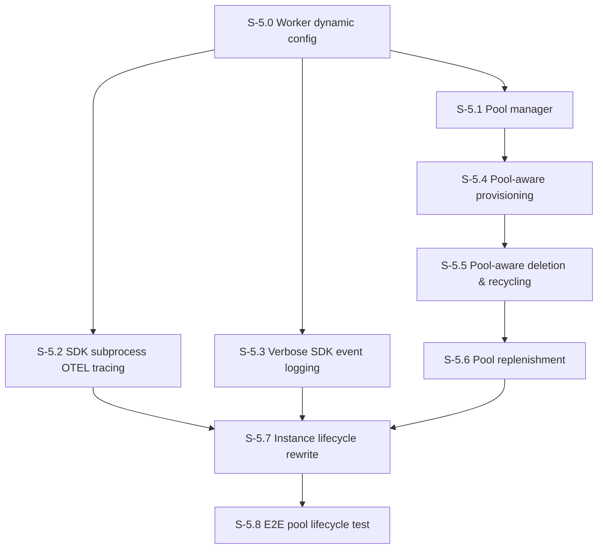

# Milestone 5: Pool-Based Worker Architecture

**Goal**: Replace per-instance Railway service provisioning with a pre-warmed worker pool. Workers are provisioned once, configured dynamically via HTTP, and recycled between instances. Distributed tracing with OTel via Sentry is fundamental — every operation must carry trace context end-to-end.

**Dependency**: M4 stories S-4.0 through S-4.7 must be complete.

**Key Insight**: In M4, provisioning an instance means creating a Railway service (2–5 min cold start). In M5, provisioning means assigning an already-running idle worker from a pool and sending it configuration via HTTP (< 1 second). Workers that are released go back to idle and re-enter the pool.



---

## Architecture Overview

```
Control Plane
├── Instance Registry (in-memory Map<name, InstanceRecord>)
├── Pool Manager (tracks idle/active workers)
│    ├── idle: Worker[] (provisioned, no config, waiting for assignment)
│    └── active: Map<instanceName, Worker> (configured, serving an instance)
├── Pool Replenisher (background loop, maintains target idle count)
├── Railway Client (for creating/deleting pool workers)
└── Health Poller (monitors all workers)

Worker Container (Railway)
├── State Machine: idle → configuring → active → resetting → idle
├── POST /configure — accept instance config via HTTP
├── POST /message — process messages (only when active)
├── POST /reset — clear state, return to idle
├── GET /health — reflects current state (idle/active)
└── SDK Runner (with OTEL subprocess tracing)
```

### Worker State Machine

```
(deployed) → idle
idle → [POST /configure] → configuring → active
active → [POST /reset] → resetting → idle
active → [POST /configure] → configuring → active  (re-assign without reset)
```

- **idle**: Running, healthy, no instance config. Waiting for assignment. `/message` returns 503.
- **configuring**: Applying new config. Brief transitional state.
- **active**: Fully configured, processing messages for a specific instance.
- **resetting**: Clearing session, history, config. Brief transitional state.

---

## [S-5.0] Worker Dynamic Configuration

As a developer, I want workers to accept configuration via HTTP so they can be assigned to instances without redeploying.

### Description

Add `POST /configure` endpoint to the worker. Replace env-var-only config with a two-phase approach: workers start with minimal env vars (just `ANTHROPIC_API_KEY`, `SENTRY_DSN`, `AAS_ROLE=worker`), then receive full instance config via HTTP. The worker's state machine transitions from idle → configuring → active on configure, and from active → resetting → idle on reset.

### Files to create/modify

| File | Purpose |
|------|---------|
| `src/worker/config.ts` | Add `WorkerState` union, `ConfigurePayload` schema, dynamic config application |
| `src/worker/routes.ts` | Add `POST /configure` endpoint, gate `/message` on active state |
| `src/worker/sdk-runner.ts` | Accept config dynamically instead of only via constructor |
| `src/worker/server.ts` | Update health response to include worker state |
| `src/worker/routes.test.ts` | Tests for configure, state transitions, gating |

### `POST /configure` Request Body

```typescript
{
  instanceName: string,        // e.g., "dev/A/michael"
  systemPrompt: string,
  mcpServers: McpServerConfig[],
  model: string,
  maxTurns: number,
  maxBudgetUsd: number,
  traceContext?: {             // parent trace from control plane
    sentryTrace: string,
    baggage: string,
  }
}
```

### Acceptance Criteria

- [ ] `POST /configure` transitions worker from `idle` → `active` with provided config
- [ ] `POST /configure` on an `active` worker resets session/history first, then applies new config (re-assignment)
- [ ] `POST /message` returns 503 when worker is `idle` or `configuring`
- [ ] `POST /reset` transitions `active` → `idle`, clears session, history, queue, and config
- [ ] `GET /health` response includes `state: "idle" | "configuring" | "active" | "resetting"` and `instanceName` (null when idle)
- [ ] Worker starts in `idle` state when no `AAS_INSTANCE_NAME` env var is set
- [ ] Worker starts in `active` state when `AAS_INSTANCE_NAME` env var IS set (backwards compat with M4 per-instance provisioning)
- [ ] Sentry service name updates dynamically: `aas-worker-idle` → `aas-worker-{instanceName}`
- [ ] Telemetry: `POST /configure` wrapped in span, logs full config summary (system prompt length, MCP server count, model)
- [ ] Telemetry: system prompt logged via `chunkedLog` on configure (verbose — the system prompt is the most important debugging artifact)

---

## [S-5.1] Pool Manager

As a developer, I want the control plane to manage a pool of idle workers so instances can be provisioned instantly.

### Description

Create `src/pool/manager.ts` with a `PoolManager` class that tracks idle and active workers. The pool manager is the single source of truth for worker assignments.

### Files to create

| File | Purpose |
|------|---------|
| `src/pool/manager.ts` | PoolManager class — idle/active tracking, acquire/release |
| `src/pool/types.ts` | `PoolWorker` type, pool config |
| `src/pool/manager.test.ts` | Unit tests |

### PoolWorker Type

```typescript
type PoolWorker = {
  workerId: string,           // unique ID (e.g., Railway service ID)
  workerUrl: string,          // internal Railway URL
  railwayServiceId: string,
  state: 'idle' | 'active',
  assignedInstance: string | null,  // instance name when active
  lastHealthAt: string | null,
  createdAt: string,
}
```

### Pool Configuration (env vars)

| Env Var | Default | Description |
|---------|---------|-------------|
| `AAS_POOL_TARGET_IDLE` | `2` | Target number of idle workers to maintain |
| `AAS_POOL_MAX_TOTAL` | `10` | Maximum total workers (idle + active) |

### Acceptance Criteria

- [ ] `acquire()` → returns an idle worker and marks it active, or null if pool empty
- [ ] `release(workerId)` → marks worker as idle, clears assignment
- [ ] `addWorker(worker)` → adds a newly provisioned worker to idle pool
- [ ] `removeWorker(workerId)` → removes a worker from pool entirely
- [ ] `getStatus()` → returns `{ idle: number, active: number, total: number, targetIdle: number, maxTotal: number }`
- [ ] `getWorkerByInstance(instanceName)` → returns the worker assigned to an instance
- [ ] Metrics: `pool.idle`, `pool.active`, `pool.total` gauges emitted on every state change
- [ ] Logs: every acquire/release/add/remove logged with worker ID and instance name

---

## [S-5.2] SDK Subprocess OTEL Tracing

As a developer, I want SDK subprocess spans to appear as children of the worker's invocation span in Sentry so I get full end-to-end trace visibility.

### Description

The Claude Agent SDK `query()` runs as a subprocess. To connect its internal spans (LLM calls, tool execution) to the worker's trace, we must pass OTEL environment variables to the subprocess. Parse the Sentry DSN to derive the OTLP endpoint and set the required env vars before spawning.

### Files to create/modify

| File | Purpose |
|------|---------|
| `src/telemetry/otel-env.ts` | Helper to derive OTEL env vars from Sentry DSN + active span |
| `src/worker/sdk-runner.ts` | Pass OTEL env vars to `query()` options |
| `src/telemetry/otel-env.test.ts` | Unit tests for OTEL env derivation |

### OTEL Environment Variables

```typescript
function getOtelEnvVars(sentryDsn: string, span: Sentry.Span): Record<string, string> {
  // Parse DSN: https://{key}@{host}/{projectId}
  // OTLP endpoint: https://{host}/api/{projectId}/otlp/
  // Auth header: {key} as bearer token

  const { traceId, spanId } = span.spanContext();

  return {
    OTEL_EXPORTER_OTLP_ENDPOINT: `https://${host}/api/${projectId}/otlp/`,
    OTEL_EXPORTER_OTLP_HEADERS: `Authorization=Bearer ${key}`,
    OTEL_RESOURCE_ATTRIBUTES: `service.name=aas-sdk-${instanceName}`,
    TRACEPARENT: `00-${traceId}-${spanId}-01`,
  };
}
```

### Trace Hierarchy with OTEL

```
Caller Trace
  └── Control Plane: POST /v1/instances/{name}/message
        └── Proxy Request
              └── Worker: POST /message
                    └── SDK Invocation (parent span)
                         ├── [SDK subprocess spans via OTEL]
                         │    ├── claude.completion (LLM call)
                         │    ├── tool.execute (tool call)
                         │    └── claude.completion (LLM call)
                         ├── Verbose logs (tool inputs, tool results, reasoning)
                         └── Invocation metrics
```

### Acceptance Criteria

- [ ] `getOtelEnvVars(dsn, span)` correctly parses Sentry DSN and derives OTLP endpoint
- [ ] SDK `query()` receives OTEL env vars so subprocess spans are children of invocation span
- [ ] In Sentry, SDK subprocess spans (LLM calls, tool execution) appear nested under the worker's invocation span
- [ ] `TRACEPARENT` header uses the active invocation span's trace ID and span ID
- [ ] If Sentry DSN is missing or invalid, OTEL env vars are omitted (fail-open)
- [ ] Unit test: DSN parsing for various Sentry DSN formats

---

## [S-5.3] Verbose SDK Event Logging

As a developer, I want every significant SDK event logged verbosely so I can debug agent behavior from logs alone, without needing to reproduce the scenario.

### Description

Enhance `SdkRunner` to log every SDK event with full content. System prompts, tool call inputs, tool results, and assistant reasoning text are all logged via `chunkedLog`. Every log line follows the structured format: `{instanceName} | {event}.{turn} | {content}`.

### Files to modify

| File | Purpose |
|------|---------|
| `src/worker/sdk-runner.ts` | Add verbose logging for all SDK events |

### Log Events

| Event | Format | Content |
|-------|--------|---------|
| `message.start` | `{name} \| message.start \| invocationId={id} prompt.len={n}` | Invocation metadata |
| `prompt` | `{name} \| prompt \| [chunked]` | Full system prompt (first invocation only, or on config change) |
| `user.{turn}` | `{name} \| user.{turn} \| [chunked]` | User message text |
| `assistant.{turn}` | `{name} \| assistant.{turn} \| [chunked]` | Full assistant text for this turn |
| `tool_use.{turn}` | `{name} \| tool_use.{turn} \| {toolName} [chunked input]` | Tool name + full JSON input |
| `tool_result.{turn}` | `{name} \| tool_result.{turn} \| {toolName} [chunked result]` | Tool name + full result |
| `reasoning.{turn}` | `{name} \| reasoning.{turn} \| [chunked]` | Extended thinking / reasoning content (if present) |
| `message.done` | `{name} \| message.done \| status={s} turns={n} cost=${c} duration={d}ms` | Completion summary |
| `message.error` | `{name} \| message.error \| {error}` | Error details |

### Chunking Rules

- System prompts: always chunked (typically 2k–20k chars)
- Tool inputs: chunked if > 5000 chars
- Tool results: chunked if > 5000 chars
- Assistant text: chunked if > 5000 chars
- Reasoning: chunked if > 5000 chars

### Acceptance Criteria

- [ ] System prompt logged via `chunkedLog` on first invocation for an instance
- [ ] User message logged on every invocation
- [ ] Every `assistant_text` block logged with full text, chunked if needed
- [ ] Every `tool_use` logged with tool name and full JSON input
- [ ] Every `tool_result` logged with tool name and full result content
- [ ] Reasoning/thinking content logged if present in SDK messages
- [ ] All log lines follow the `{instanceName} | {event}.{turn} | {content}` format
- [ ] All logs include `invocationId` as a Sentry attribute for filterability
- [ ] Log content is not truncated or summarized — full content is always preserved (chunked if long)
- [ ] `message.done` summary includes turns, cost, duration, stop reason
- [ ] Existing SSE event streaming is unaffected — logging is additive

---

## [S-5.4] Pool-Aware Provisioning

As a developer, I want `POST /v1/instances` to assign a worker from the pool instead of creating a Railway service, so provisioning completes in under a second.

### Description

Rewrite the provisioning flow to first attempt pool assignment. If the pool has idle workers, acquire one and call `POST /configure` on it. If the pool is empty, fall back to Railway service creation (slow path) and add the new worker to the pool after it becomes healthy.

### Files to modify

| File | Purpose |
|------|---------|
| `src/routes/instances.ts` | POST handler uses pool manager |
| `src/railway/provisioner.ts` | Add pool-aware provisioning path |
| `src/routes/instances.test.ts` | Tests for pool assignment |

### Provisioning Flow

```
POST /v1/instances
  ├── pool has idle worker?
  │    ├── YES → acquire worker → POST /configure → status: ready (< 1s)
  │    └── NO  → Railway serviceCreate → deploy → health poll → status: ready (2-5 min)
  └── return 202 with instance
```

### Trace Propagation on Configure

When calling `POST /configure` on the worker, the control plane forwards trace context:

```typescript
const traceHeaders = getTraceHeaders();
await fetch(`${worker.workerUrl}/configure`, {
  method: "POST",
  headers: { "Content-Type": "application/json", ...traceHeaders },
  body: JSON.stringify({
    ...configPayload,
    traceContext: {
      sentryTrace: traceHeaders["sentry-trace"],
      baggage: traceHeaders["baggage"],
    },
  }),
});
```

### Acceptance Criteria

- [ ] POST /v1/instances acquires an idle worker when available → status goes directly to `ready`
- [ ] POST /v1/instances falls back to Railway provisioning when pool is empty → status follows `provisioning` → `deploying` → `ready`
- [ ] `POST /configure` call to worker carries `sentry-trace` and `baggage` headers (distributed trace continuity)
- [ ] Worker's configure span appears as a child of the control plane's provision span in Sentry
- [ ] Instance record stores `poolWorkerId` linking to the assigned pool worker
- [ ] Metrics: `provision.pool_hit` vs `provision.pool_miss` counters
- [ ] Provisioning latency metric captures the dramatic difference between pool hit and miss
- [ ] If `POST /configure` fails, release the worker back to idle and return error

---

## [S-5.5] Pool-Aware Deletion & Recycling

As a developer, I want `DELETE /v1/instances` to recycle the worker back to the pool instead of destroying the Railway service.

### Description

When deleting an instance backed by a pool worker, call `POST /reset` on the worker and return it to the idle pool. The Railway service stays alive. Only non-pool workers (legacy or overflow) get their Railway service deleted.

### Files to modify

| File | Purpose |
|------|---------|
| `src/routes/instances.ts` | DELETE handler uses pool manager |
| `src/routes/instances.test.ts` | Tests for recycling |

### Deletion Flow

```
DELETE /v1/instances/{name}
  ├── instance has poolWorkerId?
  │    ├── YES → POST /reset on worker → release to pool → remove instance record
  │    └── NO  → Railway serviceDelete → remove instance record (legacy M4 path)
  └── return { deleted: 1 }
```

### Acceptance Criteria

- [ ] DELETE recycles pool workers: calls `POST /reset`, releases to idle pool
- [ ] DELETE destroys non-pool workers: calls Railway `serviceDelete`
- [ ] Nuke-by-prefix recycles all matching pool workers
- [ ] Recycled worker is immediately available for re-assignment
- [ ] Trace context propagated on `POST /reset` call
- [ ] Metrics: `recycle.count`, `recycle.duration_ms`
- [ ] If `POST /reset` fails, remove worker from pool entirely (don't leave broken workers in pool)

---

## [S-5.6] Pool Replenishment

As a developer, I want the control plane to automatically maintain a target number of idle workers so provisioning always hits the fast path.

### Description

Background loop that monitors pool state and provisions new Railway services when idle count drops below target. Also terminates excess idle workers when count exceeds max.

### Files to create

| File | Purpose |
|------|---------|
| `src/pool/replenisher.ts` | Background loop for pool sizing |
| `src/pool/replenisher.test.ts` | Unit tests |

### Replenishment Logic

```
Every 30 seconds:
  idle = pool.idleCount()
  total = pool.totalCount()

  if idle < targetIdle AND total < maxTotal:
    deficit = min(targetIdle - idle, maxTotal - total)
    for i in 0..deficit:
      create Railway service (minimal env vars: AAS_ROLE=worker, ANTHROPIC_API_KEY, SENTRY_DSN)
      health poll → once healthy → add to pool as idle

  if idle > targetIdle + 2:  (hysteresis)
    excess = idle - targetIdle
    for i in 0..excess:
      remove oldest idle worker
      Railway serviceDelete
```

### Acceptance Criteria

- [ ] Replenisher creates workers when idle count drops below target
- [ ] Replenisher terminates excess workers (with hysteresis to avoid flapping)
- [ ] New pool workers use minimal env vars (no instance-specific config)
- [ ] New pool workers are added to pool only after health check passes
- [ ] Replenisher runs every 30 seconds
- [ ] `pool.replenish.created` and `pool.replenish.terminated` metrics
- [ ] Entire replenishment cycle wrapped in Sentry span
- [ ] Replenisher failure does not crash the control plane (fail-open)

---

## [S-5.7] Instance Lifecycle Rewrite

As a developer, I want the instance CRUD API to fully integrate pool architecture, OTEL tracing, and verbose logging.

### Description

Rewrite `src/routes/instances.ts` and `src/registry/store.ts` to use pool-aware provisioning/deletion, propagate traces on all worker calls, and ensure the full request lifecycle is observable. This is the integration story that ties together S-5.0 through S-5.6.

### Files to modify

| File | Purpose |
|------|---------|
| `src/routes/instances.ts` | Full CRUD rewrite with pool integration |
| `src/registry/store.ts` | Updated store with pool worker references |
| `src/shared/types.ts` | Add `poolWorkerId` to `InstanceRecord` |
| `src/routes/proxy.ts` | Resolve worker URL from pool manager |
| `src/routes/instances.test.ts` | Updated tests |
| `src/registry/store.test.ts` | Updated tests |

### Updated InstanceRecord

```typescript
type InstanceRecord = {
  // ... existing fields ...
  poolWorkerId: string | null,     // links to PoolWorker.workerId
  configuredAt: string | null,     // when POST /configure was called
}
```

### Updated Status Flow (Pool Path)

```
(not exist) → [POST, pool hit] → ready           (< 1 second)
(not exist) → [POST, pool miss] → provisioning → deploying → ready  (2-5 min)
ready → [PATCH] → configuring → ready           (POST /configure on existing worker)
ready → [DELETE] → recycling → (not exist)       (POST /reset, return to pool)
```

### Acceptance Criteria

- [ ] POST returns 202, uses pool when available, falls back to Railway
- [ ] PATCH calls `POST /configure` on the assigned worker (no Railway redeploy)
- [ ] PATCH blocked while `provisioning` → 409
- [ ] DELETE recycles pool workers, destroys non-pool workers
- [ ] GET returns `InstanceRecord` with `poolWorkerId` and `configuredAt`
- [ ] Proxy routes resolve worker URL via pool manager
- [ ] All worker HTTP calls carry `sentry-trace` + `baggage` headers
- [ ] Old `AgentInstance` type fully removed
- [ ] Verbose logging on all lifecycle operations

---

## [S-5.8] E2E Pool Lifecycle Test

As a developer, I want to verify the full pool lifecycle works end-to-end with trace continuity.

### Description

Integration test exercising: pool warm-up → provision (pool hit) → message → history → status → PATCH → message → delete (recycle) → re-provision (same worker reused). Verify Sentry traces span from control plane through worker for every operation.

### Acceptance Criteria

- [ ] Pool starts with target idle workers
- [ ] Provision hits pool → instance ready in < 2 seconds
- [ ] Send message → SSE stream with expected events
- [ ] Verbose logs visible: system prompt, tool calls, tool results
- [ ] Fetch history → conversation visible
- [ ] Fetch status → runtime info correct
- [ ] PATCH instance → worker reconfigured in-place (no redeploy)
- [ ] Delete instance → worker recycled to pool
- [ ] Re-provision → same worker ID reused from pool
- [ ] Sentry traces continuous from control plane through worker on every operation
- [ ] SDK subprocess spans visible under invocation span (OTEL propagation)
- [ ] All metrics emitted correctly (pool gauges, provision hit/miss, recycle count)
- [ ] Pool replenisher replaces used workers within 60 seconds

---

## Cross-Cutting: Distributed Tracing Requirements

Every story in M5 MUST satisfy these tracing requirements. These are not optional — they are exit criteria for every story.

### 1. Trace Propagation on All Worker HTTP Calls

Every HTTP call from control plane to worker MUST include `sentry-trace` and `baggage` headers:

```typescript
const traceHeaders = getTraceHeaders(); // from active Sentry span
fetch(workerUrl + endpoint, { headers: { ...traceHeaders, ... }, ... });
```

This applies to: `/configure`, `/reset`, `/message`, `/history`, `/status`, `/health`.

### 2. Worker MUST Continue Incoming Traces

The worker's HTTP middleware already calls `Sentry.continueTrace()` with incoming headers. This MUST remain in place. All worker spans for a request MUST be children of the control plane's span.

### 3. SDK Subprocess OTEL Propagation

Every `query()` call MUST pass OTEL env vars so SDK-internal spans (LLM calls, tool execution) appear as children of the invocation span in Sentry.

### 4. Verbose Logging Is Mandatory

Every SDK event (system prompt, user message, assistant text, tool calls, tool results, reasoning) MUST be logged with full content using `chunkedLog`. No summarization, no truncation. The logs must be sufficient to reconstruct the entire agent conversation from Sentry alone.

### 5. Log Format

All log lines MUST follow:
```
{instanceName} | {event}.{turn} | {content/attributes}
```

With `invocationId` as a Sentry attribute on every log entry.

### 6. Response Headers

All responses MUST include `x-sentry-trace-id` via `jsonResponse()` / `streamResponse()` helpers.
