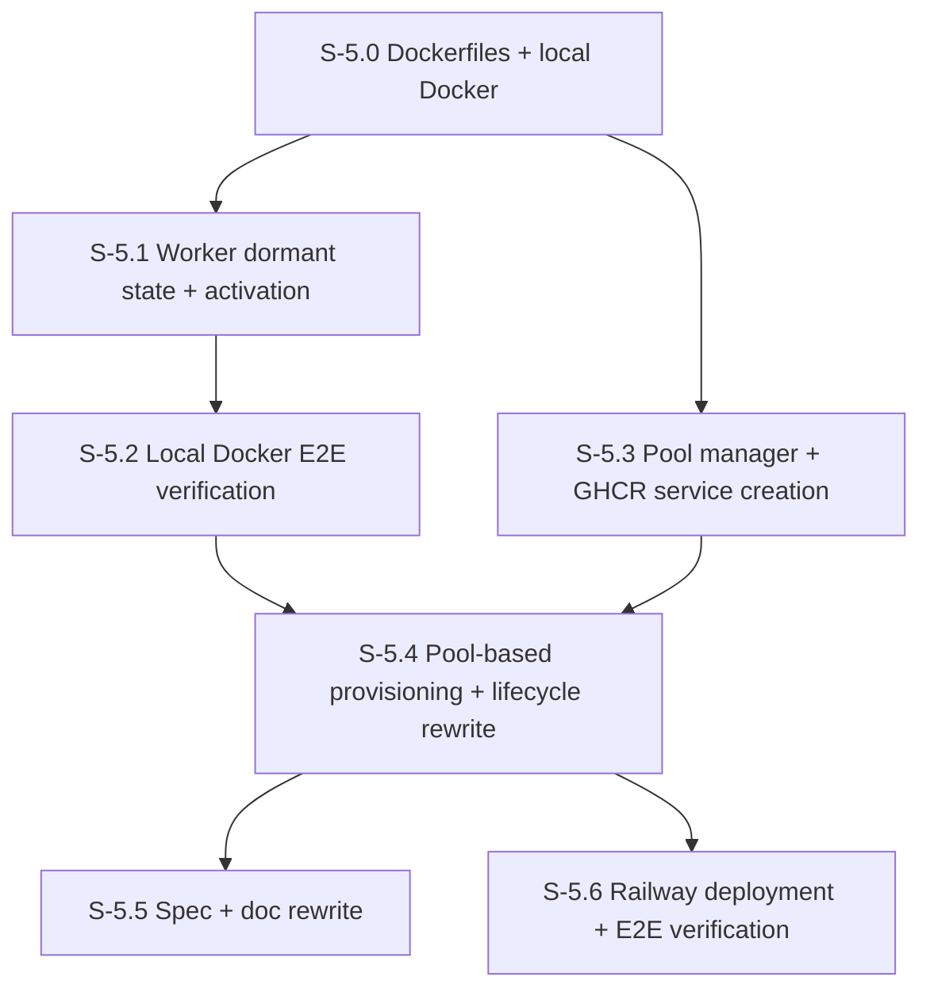

# Milestone 5: Pool-Based Worker Architecture

**Goal**: Replace the per-agent Railpack build flow with pre-built Docker images (GHCR) and a pool of dormant worker services. Agent creation goes from minutes (Railpack rebuild) to seconds (HTTP activation of a pre-provisioned worker).

**Dependency**: M4 stories S-4.0 through S-4.7 must be merged before starting M5.

**Problems solved**:
1. **Railpack rebuilds**: Every new agent triggered a full container build (~2-3 min). No Dockerfile meant no control over caching.
2. **Single image, dual role**: One codebase with `AAS_ROLE` env var switch. Every worker service rebuilt the same code from scratch.
3. **Slow debugging**: No local Docker environment; all debugging happened on Railway.



---

## Architecture

```
Build Pipeline:
  docker build -f Dockerfile.cp → ghcr.io/.../aas-cp:latest → push
  docker build -f Dockerfile.worker → ghcr.io/.../aas-worker:latest → push

Railway:
  CP service (1x, pulls aas-cp image)
    ├── Instance Registry (in-memory)
    ├── Worker Pool Manager (creates/monitors worker services)
    └── Proxy routes → worker /message, /history, /status

  Worker services (N x, each pulls aas-worker image)
    ├── Starts DORMANT (HTTP server up, no SDK)
    ├── POST /activate → receives agent config → initializes SDK → ACTIVE
    └── POST /message, GET /history, GET /status, etc.

Provisioning Flow:
  POST /v1/instances → pick dormant worker → POST /activate → ready (seconds)

Pool Scaling:
  Background monitor: dormant_count < 10 → create 10 more worker services
```

## Key Design Decisions

| Decision | Choice | Rationale |
|----------|--------|-----------|
| Image delivery | GHCR (pre-built) | No Railway builds. Pool scaling is instant — just pull image |
| Worker on agent delete | Destroy + replace | Clean state, pool monitor creates replacements |
| Worker addressing | Separate Railway services | Each worker gets its own URL for direct addressing |
| Activation mechanism | `POST /activate` on worker | Fast, no rebuild, config via HTTP body not env vars |
| Worker naming | `aas-w-{monotonic-number}` | Simple, predictable, no name collisions |

---

## [S-5.0] Dockerfiles + Local Docker Environment

As a developer, I want Dockerfiles and a docker-compose for local development and testing so I can build, run, and debug the full stack locally.

### Description

Create two Dockerfiles (control plane and worker) and a docker-compose for local development. The control plane image is minimal Node.js. The worker image includes system dependencies required by the SDK (git, curl) and runs as an unprivileged `claude` user.

### Files to create

| File | Purpose |
|------|---------|
| `Dockerfile.cp` | Node 22 slim, `npm ci --omit=dev`, copies `dist/`, `ENV AAS_ROLE=control-plane`, runs `node dist/entry.js` |
| `Dockerfile.worker` | Node 22 slim, installs system deps (git, curl), creates `claude` user, copies `dist/`, `ENV AAS_ROLE=worker`, runs `node dist/entry.js` |
| `.dockerignore` | node_modules, .git, dist (built in Docker), etc. |
| `docker-compose.yml` | 1 CP + 3 workers (dormant), shared network, env vars for secrets |

### Files to modify

| File | Purpose |
|------|---------|
| `package.json` | Add `docker:build`, `docker:up`, `docker:down` scripts |

### Acceptance Criteria

- [ ] `npm run build && docker compose build` produces two distinct images
- [ ] `docker compose up` starts CP + 3 workers
- [ ] CP health endpoint responds
- [ ] Worker health endpoints respond (with dormant status, after S-5.1)

---

## [S-5.1] Worker Dormant State + Activation Endpoint

As a developer, I want workers to start in dormant mode and be activated via HTTP so that agent configuration is delivered at activation time, not at boot.

### Description

Workers boot with only secrets (ANTHROPIC_API_KEY, SENTRY_DSN) from env vars. All other endpoints except `/health` and `/activate` return 503. `POST /activate` receives the full agent config (instanceName, systemPrompt, mcpServers, model, maxTurns, maxBudgetUsd), initializes the SDK runner, queue, and history, and transitions the worker to active.

### Files to create

| File | Purpose |
|------|---------|
| `src/worker/activation.ts` | Zod schema for activation payload, activation logic (creates SdkRunner, queue, history) |
| `src/worker/activation.test.ts` | Unit tests |

### Files to modify

| File | Purpose |
|------|---------|
| `src/worker/routes.ts` | Add `POST /activate` endpoint; add dormant guard (503 for all non-health/activate endpoints) |
| `src/worker/config.ts` | Simplify to boot config only: `ANTHROPIC_API_KEY`, `SENTRY_DSN`, `PORT`. Delete `AAS_INSTANCE_NAME`, `AAS_SYSTEM_PROMPT`, `AAS_MCP_SERVERS`, `AAS_MODEL`, `AAS_MAX_TURNS`, `AAS_MAX_BUDGET_USD` |
| `src/entry.ts` | Worker path: parse boot config only, start HTTP server in dormant mode. Remove `parseWorkerConfig()` call for agent config at boot |
| `src/shared/types.ts` | Add `activationSchema` for the POST /activate body |

### Worker State Machine

```
dormant → [POST /activate] → active
```

No deactivation (destroy + replace).

### Health Endpoint Changes

- **Dormant**: `{ status: "dormant", nodeVersion, platform, arch, uid }`
- **Active**: `{ status: "ok", instanceName: "...", nodeVersion, platform, arch, uid }`

### Acceptance Criteria

- [ ] Worker boots without agent config (only secrets from env)
- [ ] `/health` returns `dormant` status
- [ ] All endpoints except `/health` and `/activate` return 503 `{ error: "Worker is dormant", code: "dormant" }`
- [ ] `POST /activate` with valid config → worker transitions to active
- [ ] After activation, all endpoints work as before
- [ ] `POST /activate` on already-active worker → 409 Conflict
- [ ] Unit tests cover dormant guards, activation success/failure, duplicate activation
- [ ] Sentry telemetry: activation span, dormant state logged

---

## [S-5.2] Local Docker E2E Verification

As a developer, I want to verify the full lifecycle works locally in Docker before touching Railway.

### Description

Ensure docker-compose starts CP + dormant workers, activation works, and messages flow end-to-end.

### Files to modify

| File | Purpose |
|------|---------|
| `docker-compose.yml` | Ensure workers start dormant with only secrets |

### Manual Verification

1. `docker compose up` → CP + 3 dormant workers
2. Workers report dormant health
3. `curl POST worker-1/activate` with agent config → worker becomes active
4. `curl POST cp/v1/instances/.../message` → SSE stream (if proxy is wired to local workers)
5. Full message round-trip through activated worker

### Acceptance Criteria

- [ ] All worker tests pass: `npm run test`
- [ ] Docker compose environment works end-to-end locally
- [ ] Dormant → activate → message flow verified in Docker

---

## [S-5.3] Pool Manager + GHCR Image-Based Service Creation

As a developer, I want a pool manager that pre-creates dormant worker services on Railway from GHCR images so that agent provisioning is instant.

### Description

New `WorkerPool` class manages a pool of Railway worker services. Workers are created from pre-built GHCR images (no Railway builds). A background monitor ensures a minimum number of dormant workers are always available.

### Files to create

| File | Purpose |
|------|---------|
| `src/railway/pool.ts` | `WorkerPool` class with pool management, scaling, claiming, releasing |
| `src/railway/pool.test.ts` | Unit tests with mocked Railway client |

### Files to modify

| File | Purpose |
|------|---------|
| `src/railway/client.ts` | Modify `serviceCreate` to support image source: `serviceCreate(name, source?: { repo, branch } | { image: string })`. Add `serviceList()` method for discovery on CP restart. |

### WorkerPool Data Model

```typescript
type WorkerEntry = {
  workerNumber: number          // monotonic, e.g. 1, 2, 3...
  serviceId: string             // Railway service ID
  workerUrl: string             // https://{domain}
  assignedAgent: string | null  // null = dormant
  status: 'creating' | 'dormant' | 'active' | 'error'
}
```

### Key Methods

| Method | Purpose |
|--------|---------|
| `ensurePoolSize(target)` | Creates workers in batch until pool has `target` dormant workers |
| `claimWorker()` | Returns a dormant WorkerEntry and marks it as activating |
| `releaseWorker(workerNumber)` | Destroys the Railway service, removes from pool |
| `getDormantCount()` | Number of dormant workers |
| `startPoolMonitor()` | Background interval: if dormant < 10, create 10 more |
| `listWorkers()` | All workers with status |

### Pool Creation Flow (per worker)

1. `serviceCreate("aas-w-{N}", { image: "ghcr.io/.../aas-worker:latest" })`
2. `variableCollectionUpsert(serviceId, { ANTHROPIC_API_KEY, SENTRY_DSN })` — secrets only
3. `serviceDomainCreate(serviceId)` → get URL
4. Health poll until worker responds with `dormant` status
5. Add to pool registry

### Acceptance Criteria

- [ ] Pool creates worker services from GHCR image on startup
- [ ] Each worker gets its own Railway URL
- [ ] Pool monitor runs in background, scales by 10 when dormant < 10
- [ ] Workers receive only secrets via env vars (not agent config)
- [ ] `pool.claimWorker()` returns a dormant worker
- [ ] `pool.releaseWorker()` destroys the Railway service
- [ ] Railway client supports image-based service creation
- [ ] Railway client supports `serviceList()` for pool discovery
- [ ] Full telemetry: spans, logs, metrics for pool operations

---

## [S-5.4] Pool-Based Provisioning + Instance Lifecycle Rewrite

As a developer, I want instance provisioning to use the worker pool so that agent creation is instant (seconds instead of minutes).

### Description

Rewrite instance provisioning to claim a dormant worker from the pool and activate it via HTTP. Delete old Railpack-based provisioning.

### Files to modify

| File | Purpose |
|------|---------|
| `src/routes/instances.ts` | **Rewrite**: POST claims dormant worker + activates; PATCH destroys + re-provisions; DELETE releases worker |
| `src/railway/provisioner.ts` | **Delete/gut**: old Railpack flow replaced by pool-based activation |
| `src/railway/health-poller.ts` | **Adapt**: pool workers in `dormant` status are healthy; deploy polling used by pool manager |
| `src/registry/store.ts` | **Adapt**: add `workerNumber` field to InstanceRecord |
| `src/shared/types.ts` | Update status semantics: `provisioning` = "claiming + activating" (seconds) |

### Provisioning Flow (New)

```
POST /v1/instances:
  1. Validate input, create InstanceRecord (status: provisioning)
  2. pool.claimWorker() → get dormant worker
  3. POST {workerUrl}/activate with agent config
  4. On success: status → ready, link workerUrl + serviceId
  5. On failure: status → error, release worker
  6. Return 202 (still async, resolves in seconds)
```

### PATCH Behavior

Workers don't support reconfiguration after activation. PATCH destroys the current worker, claims a new dormant worker, and activates with updated config. Status transitions: current status → `deploying` → `ready`.

### DELETE Behavior

1. Set status → `destroying`
2. `pool.releaseWorker()` → Railway service deleted
3. Remove from store
4. Pool monitor creates replacement dormant worker

### Acceptance Criteria

- [ ] `POST /v1/instances` claims a dormant worker and activates it (seconds, not minutes)
- [ ] `DELETE /v1/instances` destroys the worker service, pool monitor creates replacement
- [ ] `PATCH /v1/instances` destroys + re-provisions with updated config
- [ ] Pool dormant count decreases on provision, increases as new workers are created
- [ ] All existing proxy routes work unchanged (worker URLs are the same format)
- [ ] Old provisioner code (`buildVariables`, `sanitizeServiceName`, `createServiceWithRetry`) deleted
- [ ] Full telemetry for new flow

---

## [S-5.5] Spec + Doc Rewrite

As a developer, I want all specs and docs updated for the new pool-based architecture so the documentation accurately reflects the system.

### Description

Aggressively rewrite all specs and docs. Delete all Railpack and old provisioning references. Update architecture diagrams, env var lists, and file references.

### Files to rewrite

| File | Purpose |
|------|---------|
| `spec/functional/README.md` | Update architecture diagram, tech stack (Docker + GHCR, not Railpack) |
| `spec/functional/railway-integration.md` | Complete rewrite: GHCR images, pool management, no Railpack |
| `spec/functional/instances.md` | Update provisioning flow (pool-based), lifecycle diagram |
| `spec/functional/worker-api.md` | Add dormant state, `/activate` endpoint, remove env-var-based config |
| `spec/plan/README.md` | Add M5, update milestone graph |
| `spec/plan/milestone-4-containerization.md` | Mark completed stories, note M5 supersedes S-4.8+ |
| `AGENTS.md` | Update deployment section, directory structure, env vars |

### Files to update (lighter touch)

| File | Purpose |
|------|---------|
| `spec/functional/invocation.md` | Update flow diagram to show pool-based worker |
| `spec/functional/telemetry.md` | Add pool manager metrics |
| `spec/functional/hierarchy.md` | Update service naming (now `aas-w-{number}` not `aas-w-{name}`) |

### Cleanup targets (remove all references to)

- Railpack
- `AAS_ROLE` as a per-worker env var (baked into Dockerfile now)
- `buildVariables()` / per-agent env var injection
- Per-agent Railway service creation
- Old provisioning flow (create → set vars → deploy → health poll → ready)

### Acceptance Criteria

- [ ] All spec files internally consistent (no contradictions)
- [ ] Stories reference correct file paths and existing code
- [ ] `AGENTS.md` accurately reflects the new architecture
- [ ] No remaining references to Railpack or old provisioning flow

---

## [S-5.6] Railway Deployment + E2E Verification

As a developer, I want to deploy the pool architecture to Railway and verify it works end-to-end.

### Description

Build and push Docker images to GHCR, deploy CP to Railway, verify pool creation and full agent lifecycle.

### Files to modify

| File | Purpose |
|------|---------|
| `package.json` | Update deploy scripts: `docker:build`, `docker:push`, `deploy` |

### Verification

1. Build + push images to GHCR
2. Deploy CP to Railway
3. CP creates worker services from GHCR image
4. Workers report dormant health
5. `POST /v1/instances` → worker activated, agent ready in seconds
6. Send message → SSE stream
7. Delete instance → worker destroyed, pool replenished
8. Verify Sentry traces span full lifecycle

### Acceptance Criteria

- [ ] Docker images build and push to GHCR
- [ ] CP deploys to Railway and creates worker pool
- [ ] Full lifecycle verified: provision → message → delete → pool replenish
- [ ] Sentry traces span from caller through CP to worker
- [ ] Agent creation completes in seconds (not minutes)

---

## Open Items (For Implementation Phase)

- **Railway image source API**: Confirm `serviceCreate` mutation accepts `source: { image: "..." }` field. If not, explore alternative (Railway CLI `railway up` with `--image`, or setting the service source after creation).
- **Railway service list API**: Need a `serviceList` or `services` query to discover existing workers on CP restart. If unavailable, CP starts fresh pool on every restart (orphan cleanup done manually or via a cleanup script).
